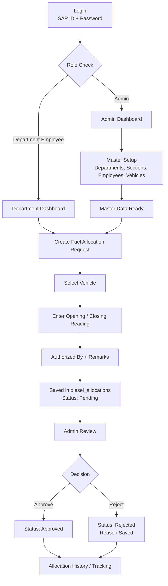

# Diesel Management System

A role-based fuel allocation management system for handling vehicle diesel requests, approvals, and tracking. The project includes an admin workflow for master data management and a department employee workflow for creating fuel allocation requests.

## Project Overview

The system is built to manage diesel/fuel allocation for vehicles in a structured way. Admin users maintain master records such as departments, sections, employees, and vehicles. Department employees create diesel allocation requests by selecting a vehicle and entering meter readings. Admin users review each request and approve or reject it with a reason.

## Main Features

- Role-based login for admin and department employees
- JWT authentication with protected routes
- Admin dashboard for allocation review
- Department dashboard for request tracking
- Department, section, employee, and vehicle management
- Unique vehicle registration number validation
- Unique department name validation
- Employee activate/deactivate option
- Opening and closing meter reading validation
- Approval and rejection workflow with reason tracking
- Standard display date format, for example `01 Jun 2026`
- Light and dark mode support

## Project Flow



## Database Table Connection

| Table | Connected With | Purpose |
|---|---|---|
| `departments` | `sections`, `employees`, `vehicles`, `diesel_allocations` | Stores department master data. |
| `sections` | `departments`, `employees`, `vehicles`, `diesel_allocations` | Stores section data under each department. |
| `employees` | `departments`, `sections`, `diesel_allocations` | Stores admin and department employee login/account data. |
| `vehicles` | `departments`, `sections`, `diesel_allocations` | Stores vehicle details and department/section mapping. |
| `diesel_allocations` | `vehicles`, `departments`, `sections`, `employees` | Main transaction table for fuel allocation requests. |

## Key Relations

| From Table | Column | To Table | Meaning |
|---|---|---|---|
| `sections` | `dept_id` | `departments.id` | Section belongs to a department. |
| `employees` | `dept_id` | `departments.id` | Employee belongs to a department. |
| `employees` | `section_id` | `sections.id` | Employee may belong to a section. |
| `vehicles` | `department_id` | `departments.id` | Vehicle belongs to a department. |
| `vehicles` | `section_id` | `sections.id` | Vehicle may belong to a section. |
| `diesel_allocations` | `vehicle_id` | `vehicles.id` | Allocation is created for a vehicle. |
| `diesel_allocations` | `department_id` | `departments.id` | Allocation is linked to a department. |
| `diesel_allocations` | `section_id` | `sections.id` | Allocation is linked to a section. |
| `diesel_allocations` | `modified_by` | `employees.id` | Tracks the user/admin who modified the allocation. |

## Tech Stack

| Layer | Technology |
|---|---|
| Frontend | React, Vite, Axios, React Router |
| Backend | Node.js, Express.js |
| Database | MySQL |
| Authentication | JWT, bcrypt |

## Setup Instructions

### Backend

```bash
cd backend
npm install
npm run dev
```

Create a `backend/.env` file:

```env
DB_HOST=localhost
DB_USER=root
DB_PASSWORD=your_mysql_password
DB_NAME=diesel_management
JWT_SECRET=your_jwt_secret
PORT=5000
```

### Frontend

```bash
cd frontend
npm install
npm run dev
```

Frontend runs on Vite's local development server. Backend APIs run on `http://localhost:5000`.

## Testing Checklist

- Login as admin and department employee
- Add department and check duplicate department validation
- Add section under a department
- Add employee and verify role/department mapping
- Deactivate and activate employee
- Add vehicle and check duplicate registration validation
- Create allocation request with valid opening/closing readings
- Try invalid readings where closing reading is less than or equal to opening reading
- Approve allocation request as admin
- Reject allocation request with reason
- Verify status/history on admin and department dashboards
- Toggle light/dark mode and check UI readability

## Short Explanation

Admin maintains master data. Department employees create diesel allocation requests for vehicles. Each request is saved in the allocation table with pending status. Admin verifies the request and approves or rejects it. The system keeps allocation history, status, reason, and related department/vehicle information for tracking.
